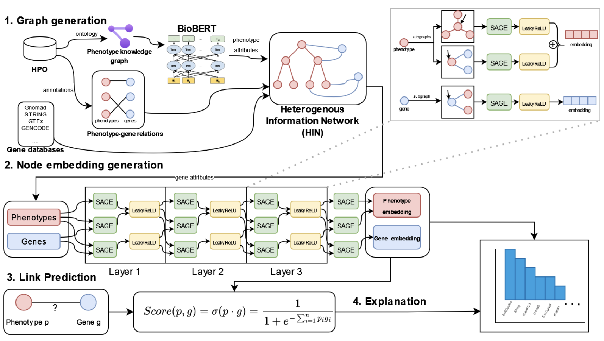

# PhenoLinker



We present a novel system called PhenoLinker capable of associating a score to a phenotype-gene relationship by using heterogeneous information networks and a convolutional neural network-based model for graphs, which can provide an explanation for the predictions. This system can aid in the discovery of new associations and in understanding the consequences of human genetic variation. Currently under review, preprint available in [SSRN](https://papers.ssrn.com/sol3/papers.cfm?abstract_id=4756046) and [ArXiv](https://arxiv.org/abs/2402.01809).

We used Pytorch Geometric 2.4.0 to generate the model. December 15, 2022 version of the HPO ontology with its genes annotations.

## Requirements

The requires libraries are in `requirements.txt`. Additionally, to support `NeighborSampler`, PyG requires either `pyg-lib` or `torch-sparse` to work.

The way to install `torch-sparse` is:

``
pip install torch-sparse torch-scatter -f https://data.pyg.org/whl/torch-2.7.0+${CUDA}.html
``

where `${CUDA$}` should be replaced by `cpu`, `cu118`, `cu126`, or `cu128` depending on your PyTorch installation.

## Features

- PhenoLinker is a link prediction GNN model based on HPO. It is able to predict associations between genes and phenotype terms from the HPO ontology. For a given relation, it returns a score from 0 to 1, which symbolises the probability of that relation being real.

- Additionally, it has an interpretability module that returns a bar plot of which of the node attributes from the graph have more weight in the score given to the relation. It is based in the Integrated Gradients algorithm from the Captum library, using the explain module from Pytorch Geometric.

## Data Preprocessing

In the data/ section we have all the neccesary data and scripts to generate the dataset to train the model. We used the December 15, 2022 version of the HPO ontology, and a BioBERT model form HuggingFace to generate attributes from the descriptions of the HPO terms. The model used is https://huggingface.co/pritamdeka/BioBERT-mnli-snli-scinli-scitail-mednli-stsb. 

- The script ``download_data.sh`` downloads all the neccesary data not already present in the repository. It has the ``phenotype_to_genes.tsv`` file from the HPO ontology that contains the gene annotations that we use to train (too large to have in the repository).
- After downloading this file, the script ``create_hpo_graph.py`` generates the files ``phenotypes.csv``, with the list of all HPO terms with the definitions, and the file ``phenotype_edges.csv``, with the relations between terms in the ontology.
- Finally, the script ``create_dataframe.py`` generates the Pytorch Geometric heterogeneous dataset in a HeteroData file, with phenotypes, genes and all the relations in the file ``dataframe.pt``.

## Model Training

- The script ``gnn.py`` in the model directory has the heterogeneous GNN model based on SAGEConv layers from Pytorch Geometric.
- The script ``train.py`` trains the model using the dataframe ``dataframe.pt``. It splits the dataset into train, eval and test, with 70% for training, 15% for test and 15% for evaluation. It trains the model in 15 epochs, using 64 hidden channels and 3 hidden layers (and the final one). It uses Adam optimizer with lr=0.001. Finally it evaluates the model in the test split and generates all metrics: F1, F1-micro, F1-macro, Precision, Recall, ROC-AUC, PR-AUC, PR-AUC-micro, PR-AUC-macro, and a confusion matrix.

## Model Inference

- An example of inference with the model is available in ``inference.py`` in the inference directory. It has an example with the gene SNCA and the HPO term HP:0100315.

## Explanation Module

- An example of the explanation module is available in the ``explainability.py`` in the explainaibility directory. It has an example with the gene SNCA and the HPO term HP:0100315.

## How to cite

```
Mellina Andreu, Jose Luis and Bernal Escobedo, Luis and Skarmeta, Antonio and Ryten, Mina and Álvarez, Sara and Cisterna García, Alejandro and Botia, Juan,
Phenolinker: Phenotype-Gene Link Prediction and Explanation Using Heterogeneous Graph Neural Networks. Available at SSRN: https://ssrn.com/abstract=4756046 or http://dx.doi.org/10.2139/ssrn.4756046
```